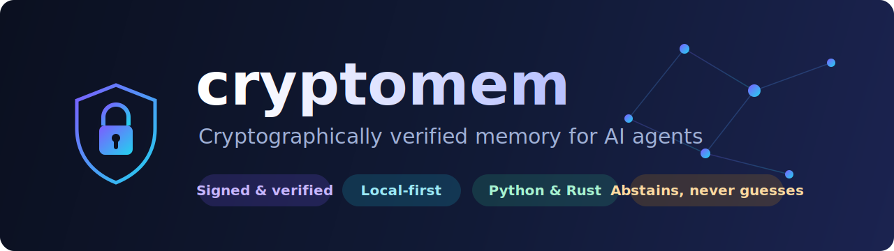
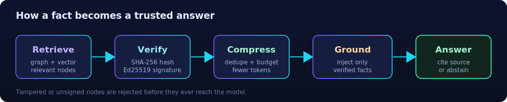
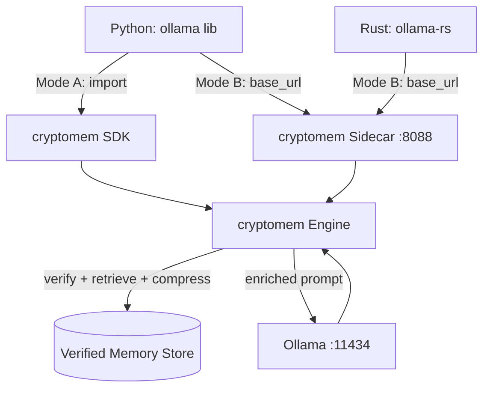

<div align="center">



<h1>cryptomem</h1>

<p><strong>Cryptographically verified, relational, persistent memory for AI agents — any model, any size, local-first.</strong></p>

<p>
  <a href="https://github.com/skilled-coderAI/cryptographic-memory/actions/workflows/ci.yml"></a>
  <a href="#license"></a>
  <a href="./ROADMAP.md"></a>
  
  
  
  
</p>

<p>
  <a href="#why">Why</a> ·
  <a href="#how-it-crosses-languages">Architecture</a> ·
  <a href="#quickstart-planned--targets-v030">Quickstart</a> ·
  <a href="#documentation">Docs</a> ·
  <a href="./ROADMAP.md">Roadmap</a> ·
  <a href="./CONTRIBUTING.md">Contribute</a>
</p>

</div>

> [!NOTE]
> **Status: the Python engine is implemented and tested (Phases P0–P5).** It provides
> SHA-256/Ed25519 signed memory with **Merkle inclusion proofs**, vector + knowledge-graph
> retrieval, a strict grounding gate, accuracy pillars (faithfulness, citations,
> semantic-entropy confidence, Chain-of-Verification), proactive memory
> (planner / triggers / write-back), BYOK key providers, and **SQLite / Neo4j / remote-backend**
> stores behind an Ollama-compatible sidecar. Packages are **not yet published** to PyPI/crates.io —
> install from source for now. The first tagged release will be **`v0.1.0`** — see
> [`ROADMAP.md`](./ROADMAP.md). A typed Rust client SDK (`rust/cryptomem-rs`) ships alongside,
> with client-side Ed25519 signing the Python engine verifies.

---

## Why

Small/local language models are cheap and private but **hallucinate** and lack persistent,
verifiable memory. `cryptomem` gives any model — including tiny local Ollama SLMs — a
**relational, persistent, cryptographically verified** memory.

<table>
<tr>
<td width="50%" valign="top">

### 🔐 Verifiable, not trust-based
Every fact is hashed (SHA-256) and signed (Ed25519). Tampered or unverified facts are **never** injected — the agent **abstains** instead of guessing.

### 🕸️ Relational persistence
GraphRAG-style nodes + edges. **SQLite** by default; a graph-native **Neo4j** store and a zero-trust **remote ledger backend** are first-class and selectable by config.

</td>
<td width="50%" valign="top">

### 🦀 Works from Python *and* Rust
A FastAPI **Ollama-compatible sidecar** lets any Ollama client get verified memory by changing only the base URL — **zero inference-code changes.**

### 🪶 Token-efficient & potato-friendly
retrieve → dedupe → rank → budget → compress → cache. Runs and tests on an **8 GB, CPU-only** laptop (mock mode needs no models at all).

</td>
</tr>
</table>

> [!NOTE]
> **Honesty as a feature:** the ~90% hallucination-reduction / >95% accuracy targets hold under
> **closed-domain, abstention-allowed** conditions on a defined benchmark — the exact conditions
> are documented in [`docs/accuracy_and_hallucination.md`](./docs/accuracy_and_hallucination.md).

---

## How a fact becomes a trusted answer

<div align="center">

</div>

## How it crosses languages



The sidecar speaks **Ollama's own wire protocol**, so any Ollama client works unmodified.
Full API in [`docs/api_documentation.md`](./docs/api_documentation.md).

---

## Quickstart

```bash
# 1) a tiny local model
ollama pull qwen2.5:0.5b
ollama serve

# 2) verified-memory sidecar in front of it (from source until v0.1.0 is published)
pip install -e "./python[serve,local]"
cryptomem serve --port 8088 --ollama-url http://localhost:11434
```

The sidecar defaults to the local SQLite store. Select a different backend with
`CRYPTOMEM_*` env vars — e.g. `CRYPTOMEM_MODE=neo4j` (with `pip install -e "./python[neo4j]"`
and `CRYPTOMEM_NEO4J_URI=...`) or `CRYPTOMEM_MODE=remote` with `CRYPTOMEM_BACKEND_URL=...`
(falls back to SQLite if the backend health check fails, so edge devices stay online).

Point your existing client at the sidecar:

```python
from ollama import Client
client = Client(host="http://127.0.0.1:8088")   # cryptomem, not :11434
resp = client.chat(model="qwen2.5:0.5b",
                   messages=[{"role": "user", "content": "What budget did Project Phoenix get?"}])
print(resp["message"]["content"])   # answered only from verified memory, or abstains
```

```rust
// Rust: same idea via ollama-rs — just point at the sidecar host/port.
use ollama_rs::Ollama;
let ollama = Ollama::new("http://127.0.0.1".to_string(), 8088);
```

---

## Documentation

| Doc | Purpose |
|-----|---------|
| [`docs/research_overview.md`](./docs/research_overview.md) | Start here — problem, decisions, document map. |
| [`docs/cryptographic_memory.md`](./docs/cryptographic_memory.md) | Architecture & concepts. |
| [`docs/implementation_plan.md`](./docs/implementation_plan.md) | Engineering blueprint (modules, data model). |
| [`docs/api_documentation.md`](./docs/api_documentation.md) | Sidecar + native REST API; Python & Rust. |
| [`docs/accuracy_and_hallucination.md`](./docs/accuracy_and_hallucination.md) | Reaching the accuracy targets; eval harness. |
| [`docs/low_spec_hardware.md`](./docs/low_spec_hardware.md) | Running/developing on a low-spec laptop. |
| [`docs/hermes_integration.md`](./docs/hermes_integration.md) | Flagship NousResearch Hermes agent integration. |
| [`docs/packaging_and_release.md`](./docs/packaging_and_release.md) | PyPI / crates.io release strategy. |

---

## Project status & roadmap

See [`ROADMAP.md`](./ROADMAP.md) for the SemVer release train (v0.1 → v1.0).
This is a **monorepo**: `python/` (`cryptomem` → PyPI) and `rust/` (`cryptomem-rs` → crates.io).

## Contributing

Contributions welcome! Read [`CONTRIBUTING.md`](./CONTRIBUTING.md) and our
[`CODE_OF_CONDUCT.md`](./CODE_OF_CONDUCT.md). Look for **`good first issue`** labels.
Report security issues privately per [`SECURITY.md`](./SECURITY.md).

## License

Dual-licensed under either of **[MIT](./LICENSE-MIT)** or **[Apache License 2.0](./LICENSE-APACHE)**
at your option. The Apache-2.0 option provides an explicit patent grant, which matters for the
cryptographic code.

Unless you explicitly state otherwise, any contribution intentionally submitted for inclusion in
this work, as defined in the Apache-2.0 license, shall be dual-licensed as above, without any
additional terms or conditions.
