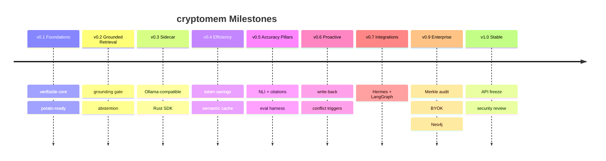

# cryptomem Roadmap

> Public roadmap for **cryptomem** — a cryptographically verified, relational, persistent memory plugin for AI agents (any model, any size, local-first). This is a living document; milestones are tracked as GitHub issues/milestones and may shift with community input.
>
> Design context: [`docs/research_overview.md`](./docs/research_overview.md) · Engineering detail: [`docs/implementation_plan.md`](./docs/implementation_plan.md).

---

## Vision

Give small/local models the factual reliability of large ones by offloading facts to a **verifiable** memory: every retrieved fact is cryptographically signed and grounded, the agent **abstains** rather than hallucinates, context is compressed to save tokens, and the same engine is usable from **Python and Rust** with zero inference-code changes.

---

## Release Train (SemVer)

We follow [Semantic Versioning](https://semver.org/). Pre-`1.0` the API may change; breaking changes are called out in the changelog.

| Version | Theme | Headline deliverables | Maps to plan |
|---------|-------|------------------------|--------------|
| **v0.1.0** — *Foundations* | Verifiable core, potato-friendly | Data model, SHA-256 hashing, Ed25519 signing/verification, SQLite store, **mock adapter + stub embedder**, `@remember` skeleton. Runs & tests on 8 GB CPU. | P0 |
| **v0.2.0** — *Grounded Retrieval* | It actually helps accuracy | MiniLM embeddings, hybrid retrieval, **strict grounding gate**, Ollama adapter, abstention behavior. | P1 |
| **v0.3.0** — *Sidecar* | Any language, zero rewrite | FastAPI **Ollama-compatible sidecar** (`cryptomem serve`), `/api/*` + `/cmem/v1/*`; **`cryptomem-rs`** client crate. | P1.5 |
| **v0.4.0** — *Efficiency* | Fewer tokens | Token budgeter, heuristic compression, dedupe, semantic answer cache (LLMLingua-2 opt-in). | P2 |
| **v0.5.0** — *Accuracy Pillars* | Toward 90/95 (closed-domain) | NLI faithfulness, per-sentence citations, semantic-entropy abstention, CoVe (all opt-in/lazy). Eval harness (RAGAS). | P3 |
| **v0.6.0** — *Proactive* | Agent intelligence | Next-fact prediction, conflict triggers, signed write-back loop. | P4 |
| **v0.7.0** — *Integrations* | Visibility & traction | **Hermes agent** integration ([`docs/hermes_integration.md`](./docs/hermes_integration.md)), LangGraph checkpoint example, cookbook. | — |
| **v0.9.0** — *Enterprise/Remote* | Scale & trust | Remote backend client, Merkle proofs/audit API, BYOK (KMS/Vault), Neo4j store. | P5 |
| **v1.0.0** — *Stable* | Production-ready | API freeze, full test matrix + benchmarks, security review, docs site, signed releases. | P6 |

---

## Packaging & Distribution Milestones

Detailed strategy in [`docs/packaging_and_release.md`](./docs/packaging_and_release.md).

- **Python (`cryptomem`)** → **PyPI** using **Hatchling** + **Trusted Publishing (OIDC)** from GitHub Actions (no long-lived tokens). Extras: `[local]`, `[serve]`, `[neo4j]`, `[compress]`, `[verify]`. Wheels are pure-Python (sidecar is FastAPI), so no per-platform build matrix needed initially.
- **Rust (`cryptomem-rs`)** → **crates.io**, release automation via **release-plz** + `cargo publish --dry-run` in CI; documented MSRV.
- **Container** → optional `ghcr.io` image bundling the sidecar + tiny default model for one-command demos.
- **Versions are kept in lock-step** between the two packages where the wire protocol changes (see packaging doc §"Shared version policy").

---

## Community & Traction Plan

The fastest signal of visibility comes from **runnable, grounded integrations** people can try in minutes.

1. **Launch assets**: README with a 30-second quickstart (local Ollama + `cryptomem serve` + a tampering demo that shows abstention), an asciinema/GIF, and the architecture diagram.
2. **Flagship integration — Hermes**: ship `examples/hermes/` showing a NousResearch Hermes agent on Ollama gaining verified memory (both transparent-sidecar and tool-calling modes). See [`docs/hermes_integration.md`](./docs/hermes_integration.md). Offer it back to the Hermes ecosystem as an example/PR for cross-visibility.
3. **Lower the barrier to contribute**: a backlog of well-scoped **`good first issue`** / **`help wanted`** items, issue/PR templates, and a clear `CONTRIBUTING.md`.
4. **Show, don't tell**: publish an honest benchmark (hallucination-rate reduction with abstention on a small closed-domain QA set) using the eval harness from v0.5 — reproducible, with the dataset and script in-repo.
5. **Distribution channels**: post to relevant communities (local-LLM, RAG, agent frameworks), submit talks/blog posts, and list the project where AI-agent tooling is discovered.
6. **Governance & responsiveness**: triage SLA in `CONTRIBUTING.md`, transparent roadmap (this file), and a public changelog so contributors see momentum.
7. **Recognition**: credit contributors in release notes and an `AUTHORS`/all-contributors section.

> Honesty as a feature: we publish the *conditions* under which the 90% hallucination-reduction / >95% accuracy targets hold (closed-domain, abstention allowed) — see [`docs/accuracy_and_hallucination.md`](./docs/accuracy_and_hallucination.md). Overclaiming erodes trust; reproducible grounding builds it.

---

## Pre-release Checklist (before v0.1.0 tag)

- [ ] Choose & add license file (**recommended: dual `MIT OR Apache-2.0`** — Apache-2.0 gives a patent grant for the crypto code).
- [ ] `SECURITY.md` with disclosure contact and supported versions.
- [ ] Issue/PR templates + `good first issue` backlog.
- [ ] CI: lint (ruff/clippy), type-check (mypy), tests, `cargo publish --dry-run`, `python -m build` smoke.
- [ ] PyPI + crates.io project names reserved; Trusted Publishing configured.
- [ ] `CHANGELOG.md` (Keep a Changelog format) seeded.
- [ ] Real contact emails substituted in `CODE_OF_CONDUCT.md` / `CONTRIBUTING.md`.
- [ ] README quickstart verified on a clean 8 GB machine.

---

## How to Influence the Roadmap

Open a **Discussion** or an **RFC issue** referencing the relevant `docs/` file. Items with clear use cases, willing implementers, and grounded justification move up. This roadmap is reviewed each minor release.

---

## Grounded References

- **Semantic Versioning:** [semver.org](https://semver.org/)
- **PyPI Trusted Publishing (OIDC):** [docs.pypi.org/trusted-publishers](https://docs.pypi.org/trusted-publishers/)
- **release-plz (Rust release automation):** [github.com/release-plz/release-plz](https://github.com/release-plz/release-plz/)
- **Conventional Commits:** [conventionalcommits.org](https://www.conventionalcommits.org/)
- **Hermes agent / function calling:** [NousResearch/Hermes-Function-Calling](https://github.com/NousResearch/Hermes-Function-Calling) · [NousResearch/hermes-agent](https://github.com/NousResearch/hermes-agent)
