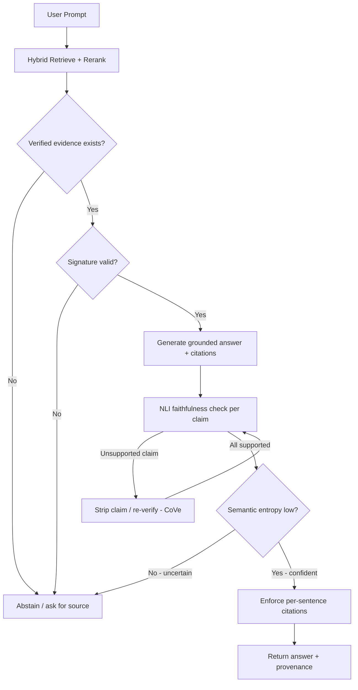

# Accuracy & Hallucination Reduction Strategy

> Research document — part of the pre-development research phase for the `cryptomem` plugin.
> Companions: [`./cryptographic_memory.md`](./cryptographic_memory.md) (architecture), [`./implementation_plan.md`](./implementation_plan.md) (engineering blueprint), [`./api_documentation.md`](./api_documentation.md) (API).
>
> **Goal under study:** reduce hallucinations by ~90% and push grounded accuracy above ~95% via the plugin, for any model size (including local Ollama SLMs).

---

## 1. Framing: When These Targets Are Achievable

A memory plugin **cannot** make a small model 95% accurate on open-ended general knowledge. The targets are achievable, and only *meaningful*, under three conditions:

1. **Closed domain** — answers are drawn from facts stored in cryptographic memory, not from the model's parameters.
2. **Abstention allowed** — the system may respond *"I cannot verify this"* instead of guessing. This is the single largest lever for cutting hallucination rate.
3. **Defined benchmark** — "95%" is only real when measured against a fixed evaluation set with fixed metrics (see §6).

> **Grounded:** 2025 research shows that enforcing strict grounding plus *learned abstention* (reject when evidence is insufficient or misleading) is what bounds hallucination.
> - [Bounding Hallucinations: Information-Theoretic Guarantees for RAG via Merlin-Arthur Protocols (2025)](https://arxiv.org/html/2512.11614v2)
> - [Abstention under insufficient evidence, ICLR 2025](https://proceedings.iclr.cc/paper_files/paper/2025/file/33dffa2e3d2ab74a783d1a8c292f66d9-Paper-Conference.pdf)

### Definitions used in this document
- **Hallucination** — any factual claim in the output not entailed by a verified `MemoryNode`.
- **Hallucination reduction (90%)** — relative reduction in unsupported-claim rate vs. the same model with no plugin, on the benchmark set.
- **Accuracy (95%)** — fraction of answers that are *correct or correctly abstained* on the benchmark set, at a stated answer (coverage) rate.

---

## 2. The Seven Required Pillars

| # | Pillar | Primary effect | Plugin module |
|---|--------|----------------|---------------|
| 1 | Strict grounding gate | Blocks ungrounded generation | `interceptor.py` (extended) |
| 2 | NLI faithfulness verification | Strips unsupported claims | `verification/faithfulness.py` |
| 3 | Uncertainty → abstention (semantic entropy) | Catches confident-but-wrong | `verification/uncertainty.py` |
| 4 | Chain-of-Verification (CoVe) | Self-corrects drafts | `verification/cove.py` |
| 5 | Citation enforcement | Guarantees traceability | `verification/citations.py` |
| 6 | High-recall retrieval + rerank | Raises the accuracy ceiling | `retrieval/reranker.py` |
| 7 | Conflict resolution | Prevents averaged-fact errors | `proactive/triggers.py` (extended) |

### 2.1 Strict Grounding Gate (largest lever)
Every factual claim must trace to a verified `MemoryNode`. If no node supports the claim, the system **retrieves more or abstains** — it never free-generates facts. Extend the existing verification gate so that *missing/unverified* evidence blocks generation, not only *tampered* evidence.

- **Grounded:** [Merlin-Arthur RAG protocols (2025)](https://arxiv.org/html/2512.11614v2); [ICLR 2025 abstention](https://proceedings.iclr.cc/paper_files/paper/2025/file/33dffa2e3d2ab74a783d1a8c292f66d9-Paper-Conference.pdf)

### 2.2 NLI Faithfulness Verification (post-generation)
Decompose the answer into **atomic claims**, then check each claim is *entailed* by the retrieved verified context using a Natural Language Inference model. Unsupported claims are stripped or trigger abstention.

- **Grounded:** this is precisely how **RAGAS Faithfulness** works — claim decomposition + NLI entailment against context.
  - [RAGAS: Automated Evaluation of RAG, EACL 2024](https://aclanthology.org/2024.eacl-demo.16.pdf)
  - [RAGAS Faithfulness metric docs](https://docs.ragas.io/en/stable/concepts/metrics/available_metrics/faithfulness/)

### 2.3 Uncertainty Estimation → Abstention (Semantic Entropy)
Sample the model N times, cluster answers by *meaning* (bidirectional entailment), and compute entropy at the meaning level. High semantic entropy → the model is uncertain → abstain or escalate.

- **Grounded:** [Farquhar et al., *Nature* 2024 — Detecting hallucinations using semantic entropy](https://www.nature.com/articles/s41586-024-07421-0). Detects confabulations and improves QA accuracy; outperforms naive entropy on AUROC/AURAC.
- **Cost note:** requires N samples per query — apply selectively (only on low-confidence queries), as it fights the token-efficiency goal.

### 2.4 Chain-of-Verification (CoVe)
Four steps: draft an answer → plan verification questions → answer them *independently* (factored: without seeing the draft) → produce a revised, verified answer.

- **Grounded:** [Chain-of-Verification Reduces Hallucination, ACL Findings 2024](https://aclanthology.org/2024.findings-acl.212/). The factored variant reduces repetition of detected hallucinations and significantly increases factuality on list-QA and long-form generation.
- **Cost note:** multi-pass; expose as an optional per-request flag.

### 2.5 Citation Enforcement
Every output sentence must carry a `node_id`, and the plugin validates that the cited node actually supports the sentence (guards against "post-rationalized" citations).

- **Grounded:** up to **57% of citations lack genuine faithfulness** — [Correctness is not Faithfulness in RAG Attributions, SIGIR ICTIR 2025](https://dl.acm.org/doi/10.1145/3731120.3744592). Sentence-level approaches improve verifiability: [CiteGuard, 2025](https://arxiv.org/html/2510.17853).

### 2.6 High-Recall Retrieval + Reranking
You cannot ground what you did not retrieve; retrieval recall is the true ceiling on accuracy. Required: **hybrid vector + graph traversal + a cross-encoder reranker**, tuned for **recall@k ≥ 0.95**.

- **Grounded:** hybrid retrieval via [`neo4j-graphrag` `HybridCypherRetriever`](https://pypi.org/project/neo4j-graphrag/).

### 2.7 Conflict Resolution
When two verified nodes disagree about an entity, resolve by recency / source-trust / signing authority and surface the conflict rather than blending facts into a hallucination.

---

## 3. Combined Verification Pipeline

---

## 4. Required New Components

**Plugin modules to build**
- `verification/faithfulness.py` — NLI claim decomposition + entailment.
- `verification/uncertainty.py` — semantic entropy sampling/clustering.
- `verification/cove.py` — chain-of-verification loop.
- `verification/citations.py` — per-sentence citation binding + validation.
- `retrieval/reranker.py` — cross-encoder reranking.
- Stricter grounding gate inside `interceptor.py`.

**Local models to run alongside Ollama**
- An **NLI model** (e.g. `deberta-v3-base-mnli`) for faithfulness checks.
- A **cross-encoder reranker** (e.g. `bge-reranker`) for retrieval precision.
- **Embeddings** (sentence-transformers) for vector recall.

---

## 5. New Configuration Knobs

Extend `Settings` (see `./implementation_plan.md` §8) with:

| Setting | Default | Purpose |
|---------|---------|---------|
| `require_grounding` | `true` | Block claims without a supporting verified node. |
| `faithfulness_threshold` | `0.97` | Min fraction of entailed atomic claims to accept an answer. |
| `semantic_entropy_threshold` | tuned | Abstain above this uncertainty. |
| `uncertainty_samples` | `5` | N samples for semantic entropy (selective). |
| `cove_enabled` | `false` | Enable chain-of-verification (latency cost). |
| `min_citation_coverage` | `1.0` | Fraction of factual sentences requiring a valid citation. |
| `abstain_on_low_confidence` | `true` | Allow abstention. |

---

## 6. Evaluation Harness (Mandatory to *Prove* 90/95)

The numbers are only real if measured. Required setup:

1. **Fixed labeled domain QA set** — questions, gold answers, and gold supporting `node_id`s.
2. **Metrics (RAGAS + custom):**
   - **Faithfulness** — atomic claims entailed by context. ([RAGAS](https://docs.ragas.io/en/stable/concepts/metrics/available_metrics/faithfulness/))
   - **Answer Relevancy** — answer addresses the query.
   - **Context Precision / Recall** — retrieval quality.
   - **Hallucination rate** — fraction of unsupported claims.
   - **Accuracy** — correct-or-correctly-abstained.
   - **Answer (coverage) rate** — fraction answered vs. abstained.
3. **CI acceptance thresholds**, e.g.: faithfulness ≥ 0.97, recall@k ≥ 0.95, hallucination-reduction ≥ 90% vs. no-plugin baseline, at a stated coverage rate.

> Always report accuracy **with** the coverage rate — the targets are achieved partly *by abstaining* on hard queries.

---

## 7. Trade-offs & Honest Caveats

- **Latency / token cost:** semantic entropy (N samples) and CoVe (multi-pass) multiply token usage and directly oppose the token-efficiency goal. Gate them behind the uncertainty score — run only when confidence is low.
- **Coverage vs. accuracy:** forbidding abstention raises coverage but lowers accuracy on hard queries. Pick an acceptable answer rate up front.
- **Open-domain limits:** outside the grounded memory, the base model's raw factuality is unchanged. The plugin's job is to keep answers *inside* verified memory or stay silent.
- **Retrieval ceiling:** if recall@k is below target, no downstream verification can recover the missing fact — invest in retrieval first.

---

## 8. Verified References

- **Semantic entropy / hallucination detection:** [Farquhar et al., *Nature* 2024](https://www.nature.com/articles/s41586-024-07421-0) ([PMC mirror](https://www.ncbi.nlm.nih.gov/pmc/articles/PMC11186750))
- **Chain-of-Verification:** [Dhuliawala et al., ACL Findings 2024](https://aclanthology.org/2024.findings-acl.212/)
- **RAGAS faithfulness / NLI grounding:** [EACL 2024](https://aclanthology.org/2024.eacl-demo.16.pdf) · [Faithfulness docs](https://docs.ragas.io/en/stable/concepts/metrics/available_metrics/faithfulness/)
- **Grounding + abstention guarantees:** [Merlin-Arthur RAG protocols, 2025](https://arxiv.org/html/2512.11614v2) · [ICLR 2025 abstention](https://proceedings.iclr.cc/paper_files/paper/2025/file/33dffa2e3d2ab74a783d1a8c292f66d9-Paper-Conference.pdf)
- **Citation faithfulness:** [Correctness ≠ Faithfulness, SIGIR ICTIR 2025](https://dl.acm.org/doi/10.1145/3731120.3744592) · [CiteGuard, 2025](https://arxiv.org/html/2510.17853)
- **Hybrid retrieval:** [neo4j-graphrag (PyPI)](https://pypi.org/project/neo4j-graphrag/)
