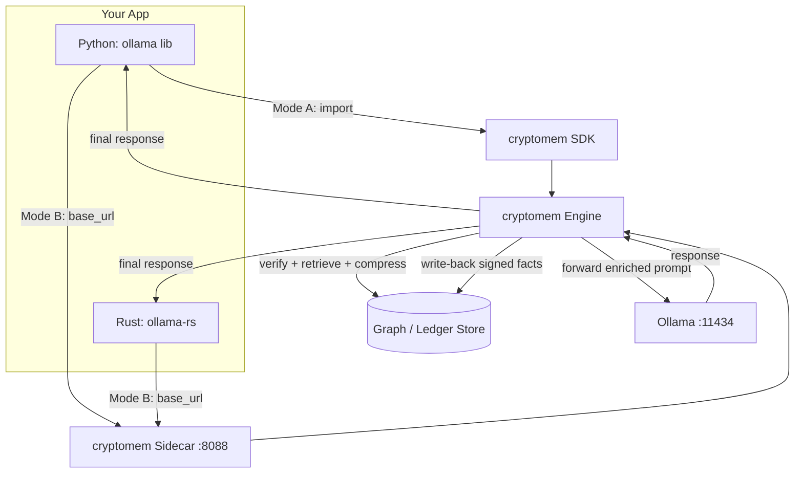

# Cryptographic Memory Plugin — API Documentation

> Companion to [`./cryptographic_memory.md`](./cryptographic_memory.md) (architecture) and [`./implementation_plan.md`](./implementation_plan.md) (engineering blueprint).
>
> This document specifies the **public API** of the `cryptomem` plugin for the concrete scenario: **you run an Ollama model locally and invoke it programmatically from Python or Rust.** The plugin sits between your code and Ollama, injecting cryptographically verified memory, compressing context, and persisting facts — without you rewriting your inference code.

---

## 0. Document Verification Status (API Design Review)

This API was cross-checked against current Ollama / client-library behavior. The findings below
are reflected in the **published** `cryptomem` ([PyPI](https://pypi.org/project/cryptomem/)) and
`cryptomem-rs` ([crates.io](https://crates.io/crates/cryptomem-rs)) implementations:

| # | Finding | Resolution |
|---|---------|-----------|
| V1 | `/api/embeddings` is a **deprecated legacy** endpoint; `/api/embed` (param `input`, supports batch arrays) is the current standard. | §3.3 now documents `/api/embed` as primary and keeps `/api/embeddings` as a legacy pass-through. ([Ollama embed docs](https://docs.ollama.com/api/embed)) |
| V2 | Ollama exposes an **experimental OpenAI-compatible** surface at `/v1/*` (`/v1/chat/completions`, `/v1/embeddings`, `/v1/models`). The original native endpoints used `/v1/*` and would **collide** if the sidecar ever proxies that surface. | Native `cryptomem` endpoints moved to the **`/cmem/v1/*`** prefix to avoid any collision. |
| V3 | Python `ollama` client accepts a custom host (`Client(host=...)`), so Python apps can also use **Mode B** (sidecar) with zero rewrite. | Noted in §5 (Mode A vs Mode B for Python). ([ollama-python](https://github.com/ollama/ollama-python)) |
| V4 | `ollama-rs` (`Ollama::new(host, port)`) and `serde` ignore unknown JSON fields by default. | Confirmed: the extra `cryptomem` response block is safely ignored by typed Rust clients (§7.2). |

**Conclusion:** with V1–V3 applied, the API suits the stated need (local Ollama, Python + Rust, drop-in base-URL swap) and is **shipped in the published packages**.

---

## 1. How It Crosses Languages

`cryptomem`'s core (signing, graph store, retrieval, compression) is implemented in **Python**. A Rust program cannot import a Python library directly, so the plugin is exposed two ways:

| Mode | Who uses it | How it works |
|------|-------------|--------------|
| **A. Python SDK (in-process)** | Python apps | Import `cryptomem`, wrap your `ollama` calls with a decorator/client. |
| **B. Sidecar Proxy (HTTP, language-agnostic)** | Rust, Python, anything | Run `cryptomem serve`. It exposes an **Ollama-compatible** REST API. You point your existing Ollama client's base URL at the sidecar instead of `http://localhost:11434`. **Zero inference-code changes.** |

This is the key design decision that makes the plugin usable from both Rust and Python: **the sidecar speaks Ollama's own wire protocol**, so any Ollama client library works unmodified.

### 1.1 Topology



### 1.2 Verified Ollama facts this design relies on

- Ollama serves its REST API on **port `11434`** by default; all inference endpoints are `POST` with a JSON body. ([Ollama API docs](https://docs.ollama.com/api/chat))
- `/api/chat` takes a `messages` array; `/api/generate` takes a `prompt` string. ([ollama/ollama api.md](https://github.com/ollama/ollama/blob/main/docs/api.md))
- Embeddings: `/api/embed` (current; param `input`, supports batch arrays, returns `embeddings`) supersedes the legacy `/api/embeddings` (param `prompt`, returns `embedding`). ([Ollama embed docs](https://docs.ollama.com/api/embed))
- Endpoints **stream by default**; send `"stream": false` for a single response object.
- Python client: `ollama` (PyPI v0.6.x) — `ollama.chat(model=..., messages=[...], stream=...)`. ([ollama python](https://github.com/ollama/ollama-python))
- Rust client: `ollama-rs` (crates.io v0.3.4) — `send_chat_messages` / `send_chat_messages_with_history`. ([ollama-rs](https://github.com/pepperoni21/ollama-rs))

---

## 2. Running the Sidecar

```bash
pip install "cryptomem[local]"
cryptomem serve --host 127.0.0.1 --port 8088 \
    --ollama-url http://localhost:11434 \
    --mode sqlite
```

Or via environment (see §8):

```bash
set CRYPTOMEM_OLLAMA_URL=http://localhost:11434
set CRYPTOMEM_PORT=8088
cryptomem serve
```

On startup the sidecar pings `GET {ollama_url}/api/tags` to confirm Ollama is reachable, and exposes its own `GET /healthz`.

---

## 3. Sidecar API — Ollama-Compatible Endpoints (Drop-in)

These mirror Ollama's schema exactly, plus optional `cryptomem` extensions. **Point your client's base URL here and existing code works.**

### 3.1 `POST /api/chat`

Enriches `messages` with verified memory, optionally compresses, forwards to Ollama, writes back new facts.

**Request** (superset of Ollama's body):

```json
{
  "model": "llama3.2",
  "messages": [
    {"role": "user", "content": "What was Project Phoenix's budget?"}
  ],
  "stream": false,
  "cryptomem": {
    "enabled": true,
    "namespace": "user_123",
    "max_context_tokens": 1500,
    "compression": true,
    "write_back": true,
    "require_verification": true
  }
}
```

The `cryptomem` key is **optional**; omit it and the sidecar uses server defaults. Everything else is passed through to Ollama untouched.

**Response** (Ollama-compatible + `cryptomem` provenance block):

```json
{
  "model": "llama3.2",
  "created_at": "2025-10-01T12:00:00Z",
  "message": {
    "role": "assistant",
    "content": "Project Phoenix launched in Q3 2025 with a budget of $5M."
  },
  "done": true,
  "cryptomem": {
    "injected_nodes": ["mem_9f8a7b"],
    "verified": true,
    "tokens_saved": 412,
    "merkle_root": "a1b2c3...",
    "proactive_suggestions": [
      {"type": "related_fact", "node_id": "mem_4a2c1", "reason": "depends_on Project Phoenix"}
    ]
  }
}
```

When `require_verification: true` and a candidate memory fails its signature check, the sidecar **omits** that node and sets `"verified": false` rather than injecting unverified content (abstain behavior, per architecture §4.2).

**Streaming:** when `"stream": true`, the body streams newline-delimited JSON chunks exactly like Ollama (`message.content` deltas). The final chunk carries `"done": true` and the `cryptomem` block.

### 3.2 `POST /api/generate`

Same enrichment for the raw-`prompt` style.

```json
{ "model": "llama3.2", "prompt": "Summarize Project Phoenix.", "stream": false,
  "cryptomem": { "namespace": "user_123" } }
```

Response matches Ollama's `/api/generate` `response` field plus the `cryptomem` block.

### 3.3 `POST /api/embed` (and legacy `/api/embeddings`)

Pass-through to Ollama embeddings; also used internally for memory indexing.

- **`/api/embed` (current):** request `{ "model": ..., "input": "text" | ["t1","t2"] }` → response `{ "embeddings": [[...]] }`. Supports batch arrays.
- **`/api/embeddings` (legacy, deprecated):** request `{ "model": ..., "prompt": "text" }` → response `{ "embedding": [...] }`. Kept for backward compatibility.

The sidecar forwards both unchanged. Internally `cryptomem` uses its own configured embedder (`all-MiniLM-L6-v2` by default — see `./low_spec_hardware.md`), not necessarily Ollama, so memory indexing works even on CPU-only setups.

### 3.4 `GET /api/tags`

Pass-through to Ollama's model list, so client libraries that probe models keep working.

---

## 4. Sidecar API — Native `cryptomem` Endpoints

Memory management, independent of inference. All paths are prefixed `/cmem/v1`.

| Method | Path | Purpose |
|--------|------|---------|
| `POST` | `/cmem/v1/memory` | Store/sign a memory node. |
| `GET`  | `/cmem/v1/memory/{id}` | Fetch a node (with verification status). |
| `POST` | `/cmem/v1/query` | Vector + entity retrieval, returns ranked verified nodes. |
| `GET`  | `/cmem/v1/memory/{id}/neighbors?depth=1` | Graph traversal of relationships. |
| `GET`  | `/cmem/v1/ledger/proof/{id}` | Merkle inclusion proof for provenance dashboard. |
| `DELETE` | `/cmem/v1/memory/{id}` | Tombstone a node (signed deletion record). |
| `GET`  | `/healthz` | Sidecar + Ollama liveness. |

> **Prefix note (V2):** native endpoints use `/cmem/v1/*`, deliberately **not** `/v1/*`, to avoid colliding with Ollama's experimental OpenAI-compatible surface (`/v1/chat/completions`, `/v1/embeddings`, `/v1/models`) if the sidecar later proxies it.

### 4.1 `POST /cmem/v1/memory`

**Request:**

```json
{
  "namespace": "user_123",
  "entity": "Project Phoenix",
  "content": "Project Phoenix launched on Q3 2025 with a budget of $5M.",
  "relationships": [
    {"type": "managed_by", "target_id": "usr_123"}
  ],
  "metadata": {"source": "Q3_Report.pdf", "ttl_days": 365}
}
```

The server computes the canonical SHA-256, signs it (Ed25519 / BYOK), assigns `node_id`, and returns the full signed `MemoryNode` (schema below). Clients **never** need to sign themselves; signing is server-side so Rust and Python behave identically.

### 4.2 `POST /cmem/v1/query`

**Request:**

```json
{ "namespace": "user_123", "text": "Phoenix budget", "top_k": 5, "depth": 1 }
```

**Response:**

```json
{
  "nodes": [ { "...": "MemoryNode (see §6)" } ],
  "verified_count": 5,
  "rejected_count": 0
}
```

### 4.3 `GET /cmem/v1/ledger/proof/{id}`

```json
{
  "node_id": "mem_9f8a7b",
  "leaf_hash": "e3b0c4...",
  "merkle_root": "a1b2c3...",
  "proof_path": [
    {"position": "right", "hash": "9f86d0..."},
    {"position": "left",  "hash": "2c2624..."}
  ]
}
```

---

## 5. Python SDK Reference (Mode A — In-Process)

For Python apps that already use the `ollama` library, the SDK wraps calls in-process (no sidecar required).

> **Python can also use Mode B (sidecar).** The `ollama` client accepts a custom host, so an existing app can point at the sidecar with **no code rewrite** — identical to the Rust approach:
> ```python
> from ollama import Client
> client = Client(host="http://127.0.0.1:8088")  # cryptomem sidecar, not 11434
> client.chat(model="llama3.2", messages=[{"role": "user", "content": "..."}])
> ```
> Use **Mode A** when you want typed provenance objects in-process; use **Mode B** when you want zero changes to existing inference code.

### 5.1 `MemoryClient`

```python
import cryptomem

mem = cryptomem.MemoryClient(
    ollama_url="http://localhost:11434",   # CRYPTOMEM_OLLAMA_URL
    namespace="user_123",
    mode="sqlite",                          # sqlite | neo4j | remote
    max_context_tokens=1500,
    compression=True,
)
```

| Method | Signature | Returns |
|--------|-----------|---------|
| `chat` | `chat(model, messages, *, stream=False, **opts)` | dict (Ollama-compatible) + `.cryptomem` provenance |
| `generate` | `generate(model, prompt, *, stream=False, **opts)` | dict |
| `add_memory` | `add_memory(entity, content, relationships=None, metadata=None)` | `MemoryNode` |
| `query` | `query(text, top_k=5, depth=1)` | `list[MemoryNode]` |
| `verify` | `verify(node_id)` | `bool` |
| `proof` | `proof(node_id)` | `MerkleProof` |

### 5.2 Decorator usage (wrap any Ollama call)

```python
import cryptomem
from ollama import chat

mem = cryptomem.MemoryClient(namespace="user_123")

@mem.remember(model="llama3.2")
def ask(prompt: str):
    # cryptomem injects verified+compressed facts into messages,
    # calls ollama.chat under the hood, and writes back new facts.
    return chat(model="llama3.2", messages=[{"role": "user", "content": prompt}])

result = ask("What was Project Phoenix's budget?")
print(result.message.content)
print(result.cryptomem.injected_nodes, result.cryptomem.tokens_saved)
```

### 5.3 Explicit client usage

```python
mem.add_memory(
    entity="Project Phoenix",
    content="Project Phoenix launched on Q3 2025 with a budget of $5M.",
    relationships=[{"type": "managed_by", "target_id": "usr_123"}],
    metadata={"source": "Q3_Report.pdf"},
)

resp = mem.chat(
    model="llama3.2",
    messages=[{"role": "user", "content": "Summarize Phoenix's launch."}],
)
print(resp["message"]["content"])
print(resp["cryptomem"]["verified"])      # True
```

---

## 6. Data Schemas

### 6.1 `MemoryNode`

```json
{
  "node_id": "mem_9f8a7b",
  "namespace": "user_123",
  "entity": "Project Phoenix",
  "content": "Project Phoenix launched on Q3 2025 with a budget of $5M.",
  "relationships": [
    {"type": "managed_by", "target_id": "usr_123"},
    {"type": "depends_on", "target_id": "mem_4a2c1"}
  ],
  "metadata": {
    "source": "Q3_Report.pdf",
    "timestamp": "2025-10-01T12:00:00Z",
    "ttl_days": 365
  },
  "crypto": {
    "hash": "e3b0c44298fc1c149afbf4c8996fb92427ae41e4649b934ca495991b7852b855",
    "signature": "3045022100a...",
    "public_key_ref": "key_admin_01",
    "merkle_root": "a1b2c3..."
  },
  "verified": true
}
```

This is the same envelope defined in architecture doc §4.1, with `namespace` and `verified` added for multi-tenant API use.

### 6.2 `cryptomem` provenance block (inference responses)

| Field | Type | Meaning |
|-------|------|---------|
| `injected_nodes` | `string[]` | Node IDs injected into the prompt. |
| `verified` | `bool` | All injected nodes passed signature verification. |
| `tokens_saved` | `int` | Tokens saved vs. naive full-history injection. |
| `merkle_root` | `string` | Root proving the served fact set. |
| `proactive_suggestions` | `object[]` | Anticipated related facts/actions. |

---

## 7. Rust Integration (Mode B — Sidecar)

Because the sidecar is Ollama-compatible, Rust integration requires **only changing the base URL**.

### 7.1 With `ollama-rs` (point it at the sidecar)

`ollama-rs` lets you set host and port. Point it at the cryptomem sidecar (`127.0.0.1:8088`) instead of Ollama (`11434`):

```rust
use ollama_rs::Ollama;
use ollama_rs::generation::chat::{request::ChatMessageRequest, ChatMessage};

#[tokio::main]
async fn main() -> Result<(), Box<dyn std::error::Error>> {
    // Sidecar speaks Ollama's protocol -> drop-in replacement.
    let ollama = Ollama::new("http://127.0.0.1".to_string(), 8088);

    let mut history = vec![];
    let res = ollama
        .send_chat_messages_with_history(
            &mut history,
            ChatMessageRequest::new(
                "llama3.2".to_string(),
                vec![ChatMessage::user(
                    "What was Project Phoenix's budget?".to_string(),
                )],
            ),
        )
        .await?;

    println!("{}", res.message.content);
    Ok(())
}
```

Memory injection, verification, and write-back all happen transparently inside the sidecar.

### 7.2 Accessing the `cryptomem` provenance block from Rust

`ollama-rs` deserializes only known Ollama fields, so the extra `cryptomem` block is ignored by its typed response. To read provenance or manage memory, call the REST API directly with `reqwest`:

```rust
use serde_json::json;

#[tokio::main]
async fn main() -> Result<(), Box<dyn std::error::Error>> {
    let client = reqwest::Client::new();

    // Inference with provenance via raw endpoint
    let resp: serde_json::Value = client
        .post("http://127.0.0.1:8088/api/chat")
        .json(&json!({
            "model": "llama3.2",
            "stream": false,
            "messages": [{"role": "user", "content": "Summarize Phoenix."}],
            "cryptomem": {"namespace": "user_123", "compression": true}
        }))
        .send().await?
        .json().await?;

    println!("answer  : {}", resp["message"]["content"]);
    println!("verified: {}", resp["cryptomem"]["verified"]);
    println!("saved   : {}", resp["cryptomem"]["tokens_saved"]);

    // Add a memory node
    client.post("http://127.0.0.1:8088/cmem/v1/memory")
        .json(&json!({
            "namespace": "user_123",
            "entity": "Project Phoenix",
            "content": "Project Phoenix launched in Q3 2025 with a $5M budget.",
            "metadata": {"source": "Q3_Report.pdf"}
        }))
        .send().await?;

    Ok(())
}
```

> **Why not a native Rust SDK?** The cryptographic engine and graph store are Python. The sidecar gives Rust full functionality over HTTP with zero FFI. A thin typed Rust SDK crate (wrapping these REST calls) is listed as a future enhancement in §10.

---

## 8. Configuration

All settings via `CRYPTOMEM_` env vars, `.env`, or CLI flags. CLI flags override env.

| Env var | Default | Description |
|---------|---------|-------------|
| `CRYPTOMEM_OLLAMA_URL` | `http://localhost:11434` | Upstream Ollama server. |
| `CRYPTOMEM_HOST` | `127.0.0.1` | Sidecar bind host. |
| `CRYPTOMEM_PORT` | `8088` | Sidecar bind port. |
| `CRYPTOMEM_MODE` | `sqlite` | `sqlite` \| `neo4j` \| `remote`. |
| `CRYPTOMEM_NEO4J_URI` | – | Required if `mode=neo4j`. |
| `CRYPTOMEM_BACKEND_URL` | – | Remote ledger/graph service if `mode=remote`. |
| `CRYPTOMEM_SIGNING_KEY_PATH` | `./cryptomem.key` | Ed25519 private key file (auto-generated if absent). |
| `CRYPTOMEM_BYOK_PROVIDER` | – | `aws-kms` \| `vault` \| none. |
| `CRYPTOMEM_MAX_CONTEXT_TOKENS` | `1500` | Hard injection budget. |
| `CRYPTOMEM_COMPRESSION` | `true` | Enable LLMLingua-2 compression. |
| `CRYPTOMEM_REQUIRE_VERIFICATION` | `true` | Abstain on signature failure. |
| `CRYPTOMEM_API_KEY` | – | If set, require `Authorization: Bearer` on sidecar requests. |

> **Note on Ollama's own env:** Ollama uses `OLLAMA_HOST` to choose its bind address. `cryptomem` does **not** read `OLLAMA_HOST`; always point the sidecar at Ollama via `CRYPTOMEM_OLLAMA_URL`.

---

## 9. Errors & Status Codes

| HTTP | Code | Meaning |
|------|------|---------|
| `200` | – | Success. |
| `400` | `invalid_request` | Malformed body / missing `model`. |
| `401` | `unauthorized` | Missing/invalid `Authorization` (when `API_KEY` set). |
| `404` | `node_not_found` | Unknown `node_id`. |
| `409` | `conflict` | Conflicting fact for entity (triggers reconciliation suggestion). |
| `422` | `verification_failed` | Retrieved node failed signature check (only surfaced when `require_verification=false` is off and strict mode requested). |
| `502` | `ollama_unreachable` | Upstream Ollama down/timeout. |
| `503` | `store_unavailable` | Graph/ledger backend unreachable. |

**Error body:**

```json
{ "error": { "code": "ollama_unreachable", "message": "Connection refused to http://localhost:11434", "retryable": true } }
```

---

## 10. Future Enhancements

- **Native Rust SDK crate** (`cryptomem-rs`) with typed structs over the §3/§4 REST API.
- **OpenAI-compatible passthrough** at `/v1/chat/completions` + `/v1/embeddings`, mirroring Ollama's own experimental OpenAI surface, so OpenAI SDKs also work as drop-ins. (Now unambiguous since native endpoints live under `/cmem/v1/*`.) ([Ollama OpenAI compatibility](https://ollama.readthedocs.io/en/openai/))
- **gRPC** transport for lower-latency sidecar calls.
- **Provenance dashboard** consuming `/cmem/v1/ledger/proof/{id}` (premium, architecture §5).

---

## 11. Verified References

- **Ollama REST API** (port 11434, `/api/chat`, `/api/generate`, streaming): [docs.ollama.com/api/chat](https://docs.ollama.com/api/chat) · [ollama/ollama api.md](https://github.com/ollama/ollama/blob/main/docs/api.md)
- **Ollama embeddings** (`/api/embed` current vs `/api/embeddings` legacy): [docs.ollama.com/api/embed](https://docs.ollama.com/api/embed)
- **Ollama OpenAI compatibility** (`/v1/*`, experimental): [ollama.readthedocs.io/en/openai](https://ollama.readthedocs.io/en/openai/)
- **Ollama Python client** (`ollama` v0.6.x, `Client(host=...)`): [github.com/ollama/ollama-python](https://github.com/ollama/ollama-python) · [PyPI](https://pypi.org/project/ollama/)
- **Ollama Rust client** (`ollama-rs` v0.3.4, `Ollama::new(host, port)`, `send_chat_messages_with_history`): [github.com/pepperoni21/ollama-rs](https://github.com/pepperoni21/ollama-rs) · [crates.io](https://crates.io/crates/ollama-rs)
- **Ed25519 signing/verification:** [PyNaCl — Digital Signatures](https://pynacl.readthedocs.io/en/latest/signing.html)
- **Graph + vector retrieval:** [neo4j-graphrag (PyPI)](https://pypi.org/project/neo4j-graphrag/)
- **Prompt compression:** [LLMLingua-2 (ACL 2024)](https://aclanthology.org/2024.findings-acl.57.pdf)
