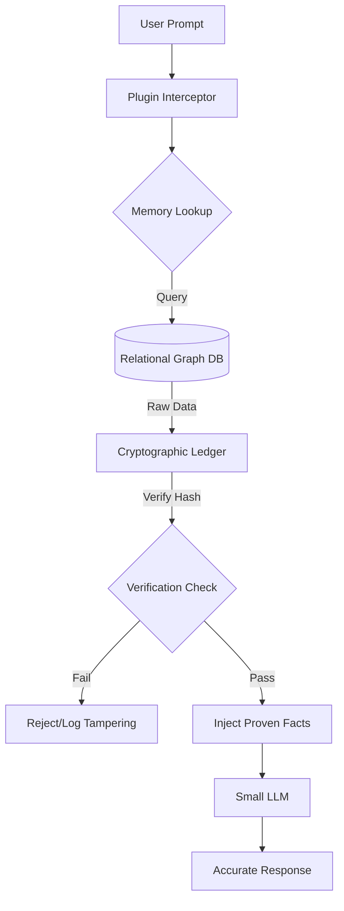

# Cryptographic Memory for LLMs: Architecture & Integration Guide

## 1. Introduction & Motivation

### 1.1 The Challenge
The Artificial Intelligence landscape is currently divided between Large Language Models (LLMs) that require massive computational resources, and Small Language Models (SLMs) that can run locally on edge devices but suffer from frequent hallucinations and factual inaccuracies. The inability of smaller models to retain long-term, verifiable facts limits their applicability in precision-critical domains such as healthcare, finance, and legal services.

### 1.2 The Solution: Cryptographic Memory
To address this, we introduce **Cryptographic Memory** — a highly reliable, relational, and persistent memory plugin designed specifically for Small Language Models. Unlike traditional vector databases or basic RAG (Retrieval-Augmented Generation) setups, Cryptographic Memory introduces cryptographic verification into the memory lifecycle. 

By replacing trust-based retrieval with cryptographically proven provenance (a concept verified by systems like Proof-Carrying Answers and RAGShield), this acts as a "hard drive" for LLMs. It allows a small, fast model to offload fact-storage to a secure, persistent, and relational backend rather than trying to memorize everything in its limited parameters.

---

## 2. Core Concepts

### 2.1 Cryptographic Verification & Provenance
Every entity, relationship, and factual node stored in the memory graph is signed and hashed using digital signatures (e.g., Ed25519 or HMAC). When the LLM retrieves a memory, the plugin validates the cryptographic signature. This guarantees that:
*   The memory has not been maliciously altered (preventing Knowledge Base Poisoning).
*   The memory's source and timestamp are explicitly verifiable via a Merkle tree structure.
*   The LLM can confidently cite the proven memory rather than hallucinating a response.

### 2.2 Relational Persistence (GraphRAG)
Unlike flat vector stores, Cryptographic Memory uses a relational graph structure. It applies paradigms similar to Microsoft's **GraphRAG** and **Neo4j**, where memories are stored as structured nodes, and their connections (e.g., "Company X" -> *acquired* -> "Company Y") are stored as edges. Both nodes and edges are cryptographically hashed, allowing the LLM to traverse complex logic trees deterministically without losing the context of relationships.

### 2.3 Plugin Architecture
The system is built as a modular plugin. It intercepts the LLM's prompt, analyzes it for memory requirements, queries the relational Cryptographic Memory, verifies the payload's signature, and injects the proven facts into the LLM's context window.

---

## 3. Architecture Overview

The system consists of three primary layers:

1. **The LLM Interceptor (Frontend Layer)**
   *   Acts as middleware between the user application and the SLM.
   *   Parses incoming prompts to extract entities and intent.
   
2. **The Cryptographic Ledger (Verification Layer)**
   *   A Merkle-tree-backed data structure that ensures provenance.
   *   Validates hashes of stored facts before they are served to the LLM.
   *   Manages cryptographic keys and access controls.

3. **The Relational Storage (Persistence Layer)**
   *   A hybrid graph-relational database (e.g., Neo4j).
   *   Stores the actual text, embeddings, metadata, and relationship mappings across sessions.

### System Flow


---

## 4. Key Components Detail

### 4.1 The Memory Node Structure
Each memory entry is stored as a JSON object with a cryptographic wrapper.

```json
{
  "node_id": "mem_9f8a7b",
  "entity": "Project Phoenix",
  "content": "Project Phoenix launched on Q3 2025 with a budget of $5M.",
  "relationships": [
    {"type": "managed_by", "target_id": "usr_123"},
    {"type": "depends_on", "target_id": "mem_4a2c1"}
  ],
  "metadata": {
    "source": "Q3_Report.pdf",
    "timestamp": "2025-10-01T12:00:00Z"
  },
  "crypto": {
    "hash": "e3b0c44298fc1c149afbf4c8996fb92427ae41e4649b934ca495991b7852b855",
    "signature": "3045022100a... [Ed25519 Signature]",
    "public_key_ref": "key_admin_01"
  }
}
```

### 4.2 The Verification Engine
**When data is written:**
1. Content, relationships, and metadata are concatenated.
2. An SHA-256 hash is generated.
3. The hash is signed using the system's private key.
4. The signed payload is stored in the Relational DB.

**When data is read:**
1. The engine recalculates the SHA-256 hash of the retrieved content.
2. It compares the hash against the stored hash and verifies the signature using the stored public key.
3. If verification fails, the system abstains from answering rather than serving unverified data.

---

## 5. Premium Customer Features (Enhancements)

To provide a premium, enterprise-grade experience, the following features are layered on top of the core engine:

1. **Memory Audit Trails (Provenance Dashboard)**: Premium users receive a visual dashboard showing exactly how an LLM arrived at a conclusion. The UI displays the relational graph and cryptographically proven citations (similar to PCA - Proof-Carrying Answers).
2. **Bring Your Own Key (BYOK)**: Enterprise customers can use their own KMS (Key Management Service). Data hosted in the cloud cannot be decrypted or tampered with by the provider.
3. **Zero-Knowledge Proofs (ZKPs) for Privacy**: Built-in support for ZKPs allowing the LLM agent to verify that a fact is true (e.g., verifying user authorizations) without the memory plugin exposing the underlying sensitive data to the LLM's context window.
4. **Agentic Memory Syncing**: Using paradigms akin to LangGraph checkpointing, memories updated by one agent (e.g., Sales AI) are instantly verifiable and accessible to other agents (e.g., Support AI) via a unified cryptographic ledger.

---

## 6. Real-World Verified References

To ensure the principles defined in this documentation are grounded in actual computing frameworks, this architecture aligns with the following verified industry and academic concepts:

*   **Verifiable RAG & Cryptographic Provenance:** The implementation of signing hashes and verifying provenance before LLM injection is successfully demonstrated in frameworks like **Proof-Carrying Answers (PCA)** and **RAGShield**, which use Ed25519 signatures and Merkle trees to prevent knowledge base poisoning.
    *   *Reference:* [Proof-Carrying Answers (PCA)](https://himjoe.github.io/proof-carrying-answers/)
    *   *Reference:* [RAGShield: Provenance-Verified Defense against Poisoning](https://arxiv.org/html/2604.00387v1) 
*   **Relational Graph Persistence:** Persistent, structured memory that extends beyond raw vector retrieval is an established best practice driven by **Microsoft's GraphRAG** and native implementations within the **neo4j-graphrag-python** package.
    *   *Reference:* [Getting Started with Neo4j GraphRAG Python Package](https://neo4j.com/blog/developer/get-started-graphrag-python-package/)
*   **Agentic Memory Verification:** Ensuring that an AI agent relies on unmodified trajectory spans and verified history is proven by repositories such as **chum-mem** (which uses HMAC-signed citations).
    *   *Reference:* [bettyguo/agent-memory & chum-mem](https://github.com/bettyguo/agent-memory)
*   **Zero-Knowledge Proofs in AI Privacy:** The utilization of ZKPs to verify memory bounds without exposing raw data to the LLM builds upon frameworks like **MemPrivacy** and **zkAgent**.
    *   *Reference:* [Generating Privacy-Preserving Personalized Advice with Zero-Knowledge Proofs and LLMs](https://arxiv.org/html/2502.06425v1)