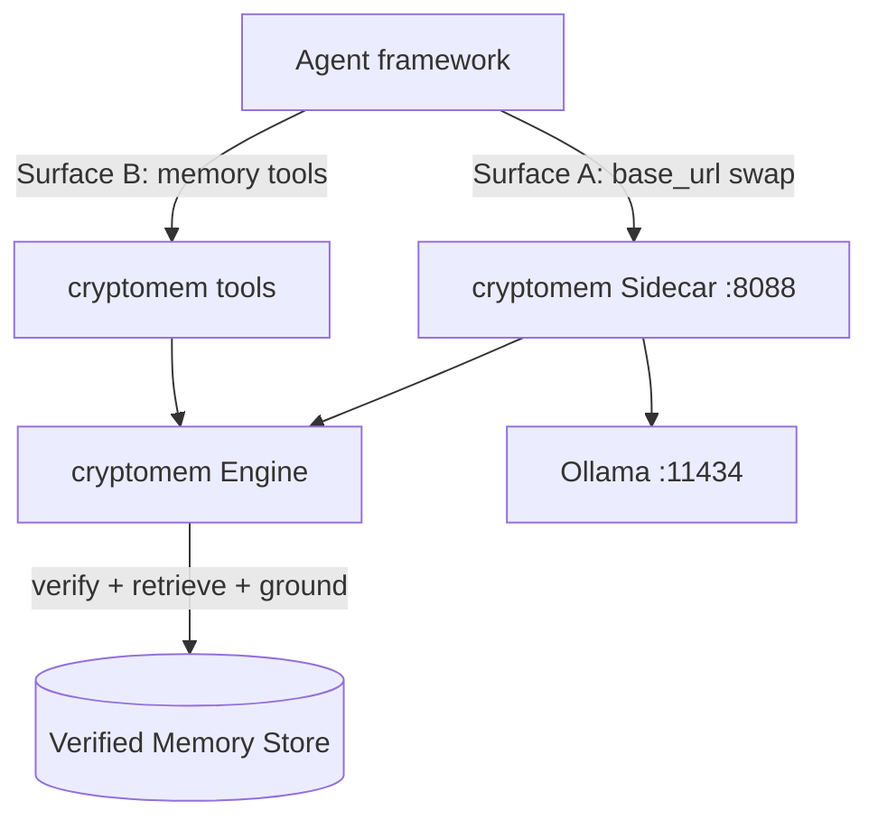

# Using `cryptomem` with agent frameworks — agno (Python) & swarms-rs (Rust)

> Usage guide — runnable, copy-pasteable integrations for two popular agent
> frameworks. Companions: [`./hermes_integration.md`](./hermes_integration.md),
> [`./api_documentation.md`](./api_documentation.md), [`../ROADMAP.md`](../ROADMAP.md).
>
> **Why this matters:** teams adopt a memory layer fastest when they can see it
> working *inside the framework they already use*. The two examples below let a
> developer wire verified, grounded memory into an [agno](https://github.com/agno-agi/agno)
> agent or a [swarms-rs](https://github.com/The-Swarm-Corporation/swarms-rs) agent in
> minutes — and watch it **abstain instead of hallucinate** in real time.

---

## 1. Two integration surfaces (recap)

`cryptomem` exposes the same guarantees through two surfaces; pick per framework:



- **Surface A — transparent sidecar.** Point any Ollama-compatible client at the
  sidecar base URL; every chat is enriched with verified memory, zero agent-code
  changes. Best when the framework speaks Ollama's wire protocol.
- **Surface B — memory tools.** Expose `memory_search` / `memory_add` /
  `memory_verify` as framework tools the model calls explicitly. Best when the
  framework drives its own LLM transport (e.g. OpenAI-compatible) and you want the
  provenance visible in the agent trajectory.

| Framework | Recommended surface | Reason |
|-----------|---------------------|--------|
| **agno** (Python) | Surface B (tools) + optional A | agno tools are plain Python callables; the engine runs in-process for the lowest latency, and the model can still target Ollama. |
| **swarms-rs** (Rust) | Surface B (tools) | swarms-rs drives an OpenAI-compatible transport, so memory is best injected as a `Tool` that calls the sidecar over `/cmem/v1/*`. |

---

## 2. Python × agno

[agno](https://github.com/agno-agi/agno) builds agents from a model, instructions,
and a list of **tools** (plain Python functions). We give the agent three verified
memory tools backed by an in-process `cryptomem.MemoryClient`, so the agent answers
**only** from signature-verified facts — or abstains.

Runnable example: [`../python/examples/agno_verified_memory.py`](../python/examples/agno_verified_memory.py).

```bash
ollama pull qwen2.5:0.5b && ollama serve            # any small local model
pip install -e "./python[local]" && pip install agno
python python/examples/agno_verified_memory.py
```

The tools wrap the engine directly:

```python
from cryptomem import MemoryClient

MEM = MemoryClient()  # respects CRYPTOMEM_* env (sqlite / neo4j / remote backend)

def recall_verified_memory(query: str) -> str:
    """Retrieve cryptographically verified facts relevant to `query`.

    Only signature-verified nodes are returned. If nothing verified matches,
    abstain instead of guessing. Ground every answer in these facts.
    """
    verified = [h for h in MEM.query(query, top_k=5) if h.verified]
    if not verified:
        return "NO_VERIFIED_MEMORY: abstain; do not guess."
    return "VERIFIED_FACTS:\n" + "\n".join(
        f"- [{h.node.node_id}] {h.node.content} (confidence={h.confidence:.2f})"
        for h in verified
    )
```

Then the agent simply lists them as tools:

```python
from agno.agent import Agent
from agno.models.ollama import Ollama

agent = Agent(
    model=Ollama(id="qwen2.5:0.5b", host="http://localhost:11434"),
    tools=[recall_verified_memory, archive_fact, verify_claim],
    instructions="Always call recall_verified_memory first and answer ONLY "
                 "from the verified facts it returns, citing node ids. If it "
                 "returns NO_VERIFIED_MEMORY, say you cannot answer.",
)
agent.print_response("What budget did Project Phoenix get?")
```

### Use cases (agno)

- **Grounded support / RAG copilots.** The agent answers product or policy
  questions strictly from signed facts, and abstains on anything not in memory —
  a measurable hallucination cut for a small local model.
- **Self-documenting agents.** `archive_fact` lets the agent persist new,
  signed facts during a session; later runs recall them (works with agno's own
  session storage for conversational state).
- **Output guardrail.** Use `verify_claim` (Chain-of-Verification) as a
  post-step / agno guardrail to re-check a draft answer against verified memory
  before it reaches the user.
- **Pluggable backend.** The same agent works against SQLite locally and a
  zero-trust **remote ledger backend** in production by changing only
  `CRYPTOMEM_MODE` / `CRYPTOMEM_BACKEND_URL` — no agent code changes.

---

## 3. Rust × swarms-rs

[swarms-rs](https://github.com/The-Swarm-Corporation/swarms-rs) builds agents with
`OpenAI::from_url(...).agent_builder()` and supports custom tools via the `Tool` /
`ToolDyn` traits. Because swarms-rs drives an OpenAI-compatible transport, the clean
integration is a **`VerifiedMemoryTool`** that queries the sidecar with the typed
[`cryptomem-rs`](../rust/cryptomem-rs) client and returns only verified facts.

Runnable example crate: [`../rust/examples/swarms-verified-memory`](../rust/examples/swarms-verified-memory).

```bash
# 1) sidecar in front of a local model
ollama pull qwen2.5:0.5b && ollama serve
cryptomem serve --port 8088 --ollama-url http://localhost:11434

# 2) run the swarms-rs agent (talks to Ollama's OpenAI-compatible API,
#    grounds via the cryptomem VerifiedMemoryTool)
cd rust/examples/swarms-verified-memory && cargo run
```

The tool wraps the blocking `CryptoMemClient` (the agent's LLM transport stays
OpenAI-compatible; only memory goes through cryptomem):

```rust
use cryptomem_rs::CryptoMemClient;
use swarms_rs::structs::tool::{Tool, ToolDyn, ToolError};

struct VerifiedMemoryTool { sidecar_url: String }

impl Tool for VerifiedMemoryTool {
    fn name(&self) -> &str { "memory_search" }
    fn definition(&self) -> swarms_rs::llm::request::ToolDefinition {
        serde_json::json!({
            "name": "memory_search",
            "description": "Retrieve cryptographically verified facts for a query. \
                            Returns only signature-verified nodes; abstain if empty.",
            "parameters": {
                "type": "object",
                "properties": { "query": { "type": "string" } },
                "required": ["query"]
            }
        }).into()
    }
}
```

`ToolDyn::call` parses `{"query": ...}`, calls `client.query(query, 5, 0)`, and
formats the verified nodes (full code in the example crate).

### Use cases (swarms-rs)

- **Verified tool calls in a multi-agent swarm.** Any agent in a
  `ConcurrentWorkflow` / `AgentRearrange` pipeline can ground its step on signed
  facts via `memory_search`, so the swarm's shared conclusions are auditable.
- **Cross-language ingest (zero-trust).** A Rust service signs facts locally with
  `cryptomem_rs::crypto::Signer` and submits them to `/cmem/v1/memory/signed`; the
  Python engine verifies the Ed25519 signature byte-for-byte before another agent
  ever reads them.
- **Edge / embedded Rust agents.** The crypto core builds with
  `--no-default-features` (no `reqwest`/TLS) for constrained targets that only need
  to sign/verify, while the full client handles networking on the gateway.
- **Backend-agnostic.** The tool reads `CRYPTOMEM_SIDECAR_URL`, so the same agent
  points at a local sidecar in dev and a hardened deployment in prod.

---

## 4. What teams and developers get

| Benefit | How the examples show it |
|---------|--------------------------|
| **See it work in real time** | Each example asks one question with a stored fact (grounded answer + node ids) and one without (the agent abstains). |
| **Drop-in for the stack you already use** | agno tools are plain functions; swarms-rs uses the standard `Tool` trait — no bespoke glue. |
| **Provenance you can audit** | Verified node ids (and Merkle inclusion proofs via `mem.proof(...)`) flow back into the agent trajectory. |
| **One memory, two languages** | The same wire protocol and signed `MemoryNode` are shared by the Python engine and the Rust client. |
| **Potato-friendly** | Both run against a tiny Ollama model on an 8 GB, CPU-only machine. |

---

## 5. Community & cross-tagging

These integrations are offered back to the upstream communities for visibility and
support around **release, publishing, and documentation**:

- **agno** — [`agno-agi/agno`](https://github.com/agno-agi/agno). Tag the repo /
  team in the cryptomem release notes and link this guide from the agno examples
  ecosystem so Python users discover verified memory.
- **swarms-rs** — [`The-Swarm-Corporation/swarms-rs`](https://github.com/The-Swarm-Corporation/swarms-rs).
  Tag the repo / team in the Rust (`cryptomem-rs`) release notes and reference the
  example crate so swarms users discover verified memory.

Both repositories are linked from the root [`../README.md`](../README.md), the
Python [`../python/README.md`](../python/README.md), and the Rust
[`../rust/cryptomem-rs/README.md`](../rust/cryptomem-rs/README.md), and are named in
the release announce step of [`./packaging_and_release.md`](./packaging_and_release.md).

---

## 6. References

- **agno (agent SDK, tools):** [github.com/agno-agi/agno](https://github.com/agno-agi/agno) · [docs.agno.com](https://docs.agno.com)
- **swarms-rs (Rust multi-agent framework):** [github.com/The-Swarm-Corporation/swarms-rs](https://github.com/The-Swarm-Corporation/swarms-rs)
- **cryptomem API (sidecar + tools surface):** [`./api_documentation.md`](./api_documentation.md)
- **Hermes integration (sister guide):** [`./hermes_integration.md`](./hermes_integration.md)
- **Accuracy & abstention conditions:** [`./accuracy_and_hallucination.md`](./accuracy_and_hallucination.md)
