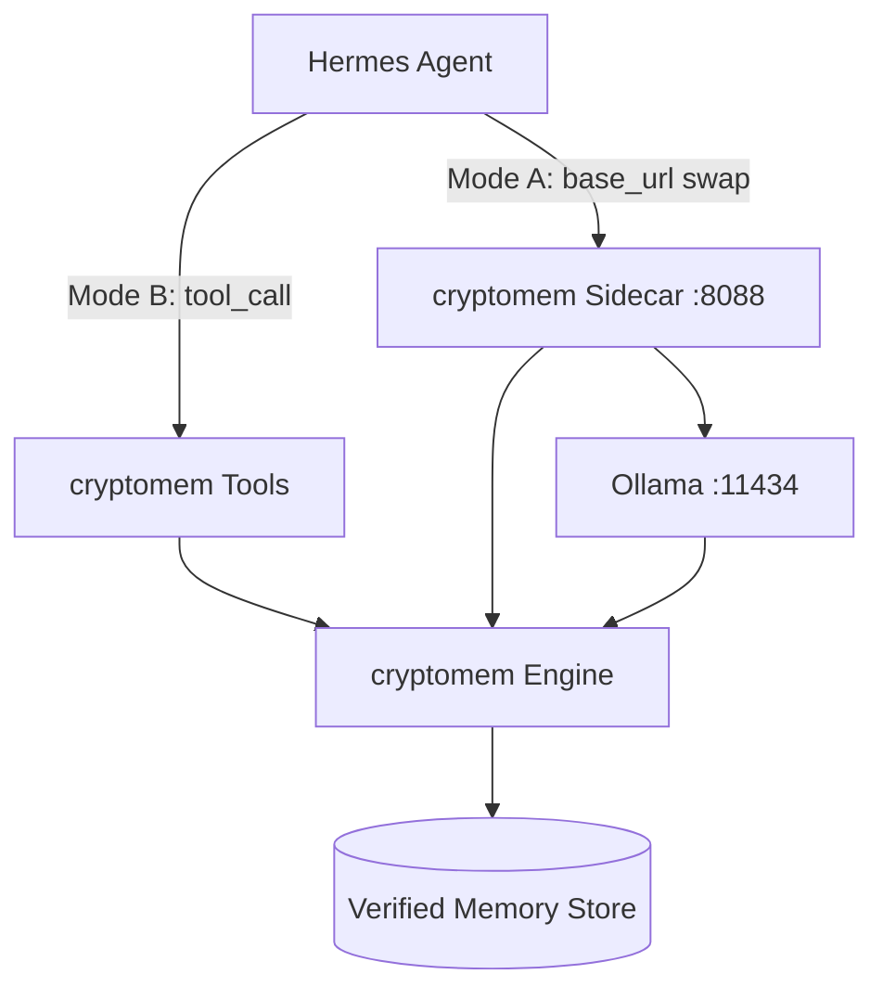

# Integrating `cryptomem` with the Hermes AI Agent

> Research document — part of the pre-development research phase.
> Companions: [`./api_documentation.md`](./api_documentation.md), [`./accuracy_and_hallucination.md`](./accuracy_and_hallucination.md), [`../ROADMAP.md`](../ROADMAP.md).
>
> **Why this matters:** Hermes is a popular open-weights agent stack. A clean, grounded Hermes integration is our flagship demo for visibility and traction — it shows a small local model becoming *verifiably* accurate.

---

## 1. What "Hermes" Is (Grounded)

**Hermes** refers to NousResearch's open models and agent tooling:

- **Hermes 3** — open-weights models with strong **function/tool calling**. The convention uses XML tags: tool definitions as JSON schemas inside `<tools>`, model invocations inside `<tool_call>`, and results returned inside `<tool_response>`. ([Hermes 3 Technical Report](https://nousresearch.com/wp-content/uploads/2024/08/Hermes-3-Technical-Report.pdf))
- **Hermes-Function-Calling** — reference repo with examples, including running **Hermes locally with Ollama** via the Python `ollama` library. ([NousResearch/Hermes-Function-Calling](https://github.com/NousResearch/Hermes-Function-Calling))
- **hermes-agent** — an agent runtime with a guide for running Hermes locally on Ollama. ([NousResearch/hermes-agent](https://github.com/NousResearch/hermes-agent))

Key fact for us: **Hermes runs on Ollama and uses tool calling.** Both are first-class integration surfaces for `cryptomem`.

---

## 2. Two Integration Modes



### Mode A — Transparent Sidecar (zero agent code changes)
Point Hermes/Ollama's base URL at the `cryptomem` sidecar instead of `:11434`. Every `/api/chat` call is transparently enriched with **verified, grounded** memory and write-back happens automatically. The agent code is unchanged.

- Best for: instant "drop-in reliability" demos.
- Grounded basis: sidecar speaks Ollama's protocol; Hermes already targets Ollama. See [`./api_documentation.md`](./api_documentation.md) §1–§3.

### Mode B — Memory as Hermes Tools (explicit, agentic)
Expose `cryptomem` operations as **tools** the Hermes model can call. The agent decides when to query/store verified memory, and the provenance is visible in the trajectory.

- Best for: agentic workflows where memory access should be explicit and auditable.
- Grounded basis: Hermes' `<tools>` / `<tool_call>` / `<tool_response>` convention. ([Hermes-Function-Calling](https://github.com/NousResearch/Hermes-Function-Calling))

---

## 3. Mode A: Sidecar Wiring

```bash
# 1) start Ollama with a Hermes model
ollama pull hermes3
ollama serve

# 2) start the cryptomem sidecar in front of it
cryptomem serve --port 8088 --ollama-url http://localhost:11434 --mode sqlite
```

Then run the Hermes agent / `ollama` client against `http://localhost:8088`:

```python
from ollama import Client
client = Client(host="http://127.0.0.1:8088")  # cryptomem, not 11434
resp = client.chat(model="hermes3", messages=[
    {"role": "user", "content": "What budget did Project Phoenix get?"}
])
print(resp["message"]["content"])
# resp also carries a `cryptomem` provenance block: injected_nodes, verified, tokens_saved
```

Result: Hermes answers **only** from verified memory or abstains — its raw hallucinations on stored facts are suppressed without touching agent code.

---

## 4. Mode B: Tool Schemas

`cryptomem` advertises these tools (JSON Schema, the format Hermes expects inside `<tools>`):

```json
[
  {
    "type": "function",
    "function": {
      "name": "memory_search",
      "description": "Retrieve cryptographically verified facts relevant to a query. Returns only signature-verified nodes; use these to answer instead of guessing.",
      "parameters": {
        "type": "object",
        "properties": {
          "query": {"type": "string"},
          "top_k": {"type": "integer", "default": 5}
        },
        "required": ["query"]
      }
    }
  },
  {
    "type": "function",
    "function": {
      "name": "memory_add",
      "description": "Persist a new fact as a signed, verifiable memory node.",
      "parameters": {
        "type": "object",
        "properties": {
          "entity": {"type": "string"},
          "content": {"type": "string"},
          "source": {"type": "string"}
        },
        "required": ["entity", "content"]
      }
    }
  },
  {
    "type": "function",
    "function": {
      "name": "memory_verify",
      "description": "Check that a fact is supported by a verified node before asserting it. Returns verified=true/false with the node_id.",
      "parameters": {
        "type": "object",
        "properties": {"claim": {"type": "string"}},
        "required": ["claim"]
      }
    }
  }
]
```

### Flow (Hermes XML convention)
1. System prompt includes the tools inside `<tools>...</tools>`.
2. Hermes emits a call: `<tool_call>{"name": "memory_search", "arguments": {"query": "Project Phoenix budget"}}</tool_call>`.
3. The runtime routes the call to `cryptomem` (`POST /cmem/v1/query`), which returns **verified** nodes.
4. The runtime returns `<tool_response>{...verified nodes...}</tool_response>` to Hermes.
5. Hermes composes a grounded answer citing `node_id`s; if `memory_verify` returns `verified=false`, the agent abstains.

> **Grounding guarantee:** because `memory_search`/`memory_verify` return only signature-verified nodes (and the engine abstains on failure — see [`./accuracy_and_hallucination.md`](./accuracy_and_hallucination.md) §2.1–2.2), the tool layer is what converts Hermes' tool-calling ability into *verifiable* answers.

---

## 5. Why This Drives Visibility

- **Concrete, runnable proof**: a `examples/hermes/` demo where a small Hermes model on Ollama stops hallucinating a stored fact (and a tampering demo where it abstains) is a strong, shareable signal.
- **Two audiences at once**: the Ollama/local-LLM community (Mode A) and the agent/tool-calling community (Mode B).
- **Ecosystem contribution**: offering the example back to the Hermes-Function-Calling / hermes-agent ecosystems creates cross-links and discovery.

This integration is scheduled for **v0.7.0** in [`../ROADMAP.md`](../ROADMAP.md).

---

## 6. Verified References

- **Hermes 3 (function calling, XML tool tags):** [Technical Report](https://nousresearch.com/wp-content/uploads/2024/08/Hermes-3-Technical-Report.pdf)
- **Hermes-Function-Calling (Ollama examples):** [github.com/NousResearch/Hermes-Function-Calling](https://github.com/NousResearch/Hermes-Function-Calling)
- **hermes-agent (run locally with Ollama):** [github.com/NousResearch/hermes-agent](https://github.com/NousResearch/hermes-agent)
- **cryptomem API (sidecar + tools surface):** [`./api_documentation.md`](./api_documentation.md)
