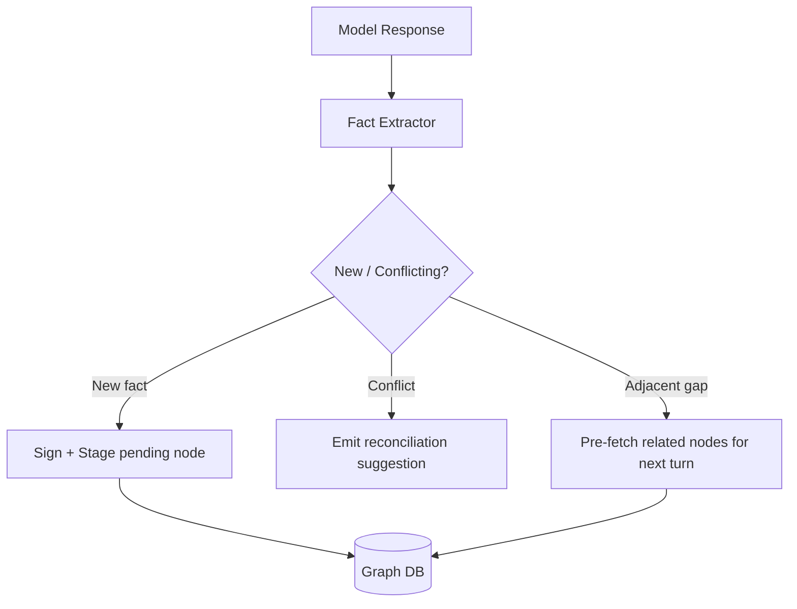

# Cryptographic Memory Plugin: Detailed Implementation Plan (Python)

> Companion to [`./cryptographic_memory.md`](./cryptographic_memory.md) (architecture), [`./api_documentation.md`](./api_documentation.md) (public API), [`./accuracy_and_hallucination.md`](./accuracy_and_hallucination.md) (verification pipeline), and [`./low_spec_hardware.md`](./low_spec_hardware.md) (potato-laptop profile). This document is the engineering blueprint for building **`cryptomem`** — a model-agnostic Python plugin that gives any AI model (large or small) verifiable persistent memory, proactive intelligence, and lower token consumption.
>
> **Endpoint convention:** native HTTP endpoints use the `/cmem/v1/*` prefix (not `/v1/*`) to avoid colliding with Ollama's experimental OpenAI-compatible surface — see `./api_documentation.md` §0 (V2).

---

## 1. Objectives & Success Criteria

| Goal | Description | Measurable Target |
|------|-------------|-------------------|
| **Accuracy** | Reduce hallucination by injecting only cryptographically verified facts; abstain otherwise. | Baseline DoD: ≥ 30% reduction in factual error rate vs. no-memory baseline. **Stretch (closed-domain + abstention + full pillars): ~90% hallucination reduction / >95% accuracy** — conditions & method in `./accuracy_and_hallucination.md`. |
| **Model-agnostic** | Work with OpenAI, Anthropic, local GGUF/Ollama, HuggingFace, regardless of size. | Single adapter interface, ≥ 4 backends; **Ollama works via sidecar with zero code change**. |
| **Proactiveness** | Anticipate needed facts and surface follow-ups/actions without being asked. | Plugin proposes ≥ 1 relevant action/fact per multi-turn session. |
| **Token Efficiency** | Inject compressed, deduplicated, relevance-ranked context. | ≥ 40% fewer prompt tokens vs. naive full-history stuffing. |
| **Integrity** | Detect and reject tampered memory. | 100% rejection of mutated payloads in test suite. |
| **Runs on a potato** | Develop & run on an 8 GB CPU-only laptop. | P0–P2 pass with mock mode + `qwen2.5:0.5b`; see `./low_spec_hardware.md`. |

**Definition of Done:** plugin installs via `pip`; wraps any LLM call with `@cryptomem.remember` (Mode A) **and** runs as `cryptomem serve` exposing an Ollama-compatible sidecar (Mode B); persists to SQLite by default (configurable backend URL for remote); and passes the integrity + token-budget + grounding test suites on an 8 GB laptop.

---

## 2. Technology Stack (Verified)

| Layer | Choice | Why / Source |
|-------|--------|--------------|
| Signing | **PyNaCl** (`nacl.signing`) Ed25519 | Battle-tested libsodium binding; `VerifyKey.verify` raises `BadSignatureError` on tamper. ([PyNaCl docs](https://pynacl.readthedocs.io/en/latest/signing.html)) |
| Hashing / Merkle | `hashlib` (SHA-256) stdlib | Deterministic content hashing per node. |
| Graph persistence | **`neo4j-graphrag`** (`VectorRetriever`, `HybridCypherRetriever`) | Native relational + vector retrieval. ([neo4j-graphrag PyPI v1.16.0](https://pypi.org/project/neo4j-graphrag/)) |
| **Default** local store | **SQLite** + `sqlite-vec` (or `chromadb`) | Zero-config, in-process, edge/potato-friendly; default mode. ([SQLite vs Neo4j](https://stackshare.io/stackups/neo4j-vs-sqlite)) |
| Embeddings | `sentence-transformers` **`all-MiniLM-L6-v2`** (ONNX) | ~80 MB, 384-dim, CPU-fast; pluggable. ([model card](https://huggingface.co/sentence-transformers/all-MiniLM-L6-v2)) |
| Prompt compression | **heuristic** (default) / **LLMLingua-2** (opt-in) | LLMLingua-2 is a ~110M BERT model — opt-in only; heuristic is model-free. ([LLMLingua-2, ACL 2024](https://aclanthology.org/2024.findings-acl.57.pdf)) |
| Faithfulness check (opt-in) | small cross-encoder **NLI** (lazy-loaded) | Atomic-claim entailment (RAGAS-style); see `./accuracy_and_hallucination.md`. |
| Reranker (opt-in) | cross-encoder (e.g. `bge-reranker`) | Raises retrieval precision/recall. |
| Sidecar server | **FastAPI** + **uvicorn** | Ollama-compatible HTTP surface (Mode B). |
| Config / validation | `pydantic-settings` | Typed config incl. backend URL & keys. |
| HTTP backend client | `httpx` | Async-capable calls to remote ledger/graph service. |

> **Tiered profiles** (see `./low_spec_hardware.md` §6): `potato` (8 GB — SQLite, tiny model, heuristic compression, verification core only), `standard` (16 GB — LLMLingua-2 + NLI), `server` (Neo4j + full verification pipeline). The **default mode is `sqlite`**, not Neo4j.

---

## 3. Package Structure

```
cryptomem/
├── pyproject.toml
├── README.md
├── cryptomem/
│   ├── __init__.py            # public API: remember(), MemoryClient
│   ├── config.py              # pydantic Settings (backend URL, keys, mode)
│   ├── models.py              # MemoryNode, Relationship, CryptoEnvelope
│   ├── crypto/
│   │   ├── signer.py          # Ed25519 sign/verify (PyNaCl)
│   │   ├── hashing.py         # canonical serialization + SHA-256
│   │   └── merkle.py          # Merkle tree for batch provenance
│   ├── store/
│   │   ├── base.py            # MemoryStore ABC
│   │   ├── neo4j_store.py     # neo4j-graphrag backend (server profile)
│   │   ├── sqlite_store.py    # local edge backend + sqlite-vec (DEFAULT)
│   │   └── remote_store.py    # httpx client -> backend URL
│   ├── embeddings/
│   │   ├── base.py            # Embedder ABC
│   │   ├── minilm.py          # all-MiniLM-L6-v2 (ONNX) local embedder
│   │   └── stub.py            # deterministic stub for tests / mock mode
│   ├── retrieval/
│   │   ├── retriever.py       # entity extraction + graph traversal + rank
│   │   └── reranker.py        # cross-encoder reranking (opt-in)
│   ├── efficiency/
│   │   ├── compressor.py      # heuristic (default) + LLMLingua-2 (opt-in)
│   │   ├── deduper.py         # near-duplicate suppression
│   │   ├── budgeter.py        # token budget enforcement (tiktoken)
│   │   └── cache.py           # semantic answer cache
│   ├── verification/         # accuracy pillars (see accuracy doc)
│   │   ├── grounding.py       # strict grounding gate
│   │   ├── faithfulness.py    # NLI atomic-claim entailment (lazy)
│   │   ├── uncertainty.py     # semantic entropy (opt-in)
│   │   ├── cove.py            # chain-of-verification (opt-in)
│   │   └── citations.py       # per-sentence citation binding
│   ├── proactive/
│   │   ├── planner.py         # anticipate next facts / actions
│   │   └── triggers.py        # rule + embedding based triggers
│   ├── adapters/
│   │   ├── base.py            # LLMAdapter ABC
│   │   ├── openai_adapter.py
│   │   ├── anthropic_adapter.py
│   │   ├── ollama_adapter.py
│   │   ├── hf_adapter.py
│   │   └── mock_adapter.py    # canned responses for model-free dev/tests
│   ├── server/
│   │   ├── app.py             # FastAPI sidecar (Ollama-compatible + /cmem/v1)
│   │   └── routes.py          # /api/chat, /api/generate, /api/embed, /cmem/v1/*
│   ├── cli.py                 # `cryptomem serve`
│   └── interceptor.py         # orchestration pipeline / decorator
└── tests/
    ├── test_crypto.py
    ├── test_store.py
    ├── test_efficiency.py
    ├── test_verification.py
    └── test_integration.py
```

---

## 4. Core Data Model

```python
# cryptomem/models.py
from pydantic import BaseModel, Field
from typing import Literal

class Relationship(BaseModel):
    type: str
    target_id: str

class CryptoEnvelope(BaseModel):
    hash: str
    signature: str
    public_key_ref: str
    merkle_root: str | None = None

class MemoryNode(BaseModel):
    node_id: str
    entity: str
    content: str
    relationships: list[Relationship] = Field(default_factory=list)
    metadata: dict = Field(default_factory=dict)   # source, timestamp, ttl
    embedding: list[float] | None = None
    crypto: CryptoEnvelope | None = None
```

The wire format matches the JSON node in `./cryptographic_memory.md` §4.1, guaranteeing the docs and code stay in sync.

---

## 5. Module Implementation Detail

### 5.1 Canonical Hashing (`crypto/hashing.py`)
Verification only works if write-time and read-time serialization are byte-identical.

```python
import hashlib, json

def canonical_bytes(node: dict) -> bytes:
    payload = {
        "entity": node["entity"],
        "content": node["content"],
        "relationships": sorted(
            [(r["type"], r["target_id"]) for r in node.get("relationships", [])]
        ),
        "metadata": node.get("metadata", {}),
    }
    return json.dumps(payload, sort_keys=True, separators=(",", ":")).encode()

def sha256(node: dict) -> str:
    return hashlib.sha256(canonical_bytes(node)).hexdigest()
```

### 5.2 Signer (`crypto/signer.py`)

```python
from nacl.signing import SigningKey, VerifyKey
from nacl.exceptions import BadSignatureError
from nacl.encoding import HexEncoder

class Signer:
    def __init__(self, signing_key: SigningKey):
        self._sk = signing_key
        self.verify_key = signing_key.verify_key

    def sign(self, digest_hex: str) -> str:
        return self._sk.sign(digest_hex.encode(), encoder=HexEncoder).signature.decode()

    @staticmethod
    def verify(pubkey_hex: str, digest_hex: str, signature_hex: str) -> bool:
        try:
            VerifyKey(pubkey_hex, encoder=HexEncoder).verify(
                digest_hex.encode(), bytes.fromhex(signature_hex)
            )
            return True
        except BadSignatureError:
            return False
```

> **BYOK hook:** `Signer` accepts an injected key provider so enterprise customers can back it with AWS KMS / HashiCorp Vault instead of a local `SigningKey` (premium feature §5 of the architecture doc).

### 5.3 Store Abstraction (`store/base.py`)

```python
from abc import ABC, abstractmethod
from cryptomem.models import MemoryNode

class MemoryStore(ABC):
    @abstractmethod
    def write(self, node: MemoryNode) -> None: ...
    @abstractmethod
    def query(self, text: str, top_k: int = 5) -> list[MemoryNode]: ...
    @abstractmethod
    def neighbors(self, node_id: str, depth: int = 1) -> list[MemoryNode]: ...
```

- **`neo4j_store.py`** uses `VectorRetriever` / `HybridCypherRetriever` for vector + relationship traversal.
- **`sqlite_store.py`** provides an offline/edge path so SLMs on-device still benefit.
- **`remote_store.py`** is the **backend URL** integration (see §8).

### 5.4 Retrieval Pipeline (`retrieval/retriever.py`)
1. Extract entities/intent from the prompt (lightweight spaCy or regex NER, optionally a small model).
2. Vector search top-K candidate nodes.
3. Expand via `neighbors()` to pull related edges (GraphRAG traversal).
4. **Verify every node** through `Signer.verify`; drop/flag failures.
5. Rerank by relevance × recency × edge-distance.

### 5.5 Verification Gate (in `interceptor.py`)
Mirrors §4.2 of the architecture doc: recompute SHA-256, compare to stored hash, verify signature. On failure the pipeline **abstains** (returns a "cannot verify" sentinel) rather than injecting unverified data.

---

## 6. Token Efficiency Strategy

| Technique | Module | Effect |
|-----------|--------|--------|
| **Relevance budgeting** | `efficiency/budgeter.py` | Count tokens with `tiktoken`; fill context up to a hard budget, highest-ranked first. |
| **Prompt compression** | `efficiency/compressor.py` | LLMLingua-2 compresses retrieved facts (not system prompt/tools) for 4–20x reduction. |
| **Deduplication** | `efficiency/deduper.py` | Cosine-similarity suppression of near-duplicate memories before injection. |
| **Structured injection** | `interceptor.py` | Inject compact `entity: content` lines instead of raw documents. |
| **Semantic cache** | `store` layer | Cache verified answers keyed by normalized query embedding; skip the LLM entirely on hits. |

> Order matters: **retrieve → dedupe → rank → budget → compress → (cache result)**. Never compress system prompts or tool schemas.

```python
# efficiency/budgeter.py (sketch)
import tiktoken
enc = tiktoken.get_encoding("cl100k_base")

def fit_to_budget(nodes, max_tokens: int):
    out, used = [], 0
    for n in nodes:                       # assumes pre-ranked
        cost = len(enc.encode(n.content))
        if used + cost > max_tokens:
            break
        out.append(n); used += cost
    return out
```

---

## 7. Proactiveness Layer (`proactive/`)

The plugin does more than answer — it anticipates.

1. **Next-fact prediction (`planner.py`):** after each turn, embed the conversation tail, query the graph for *adjacent* unused nodes, and pre-stage them for the likely next question.
2. **Action triggers (`triggers.py`):** rule + embedding hybrid. Example rules:
   - Memory `ttl` expired → suggest a refresh/re-verification.
   - Conflicting facts detected (same entity, divergent content) → raise a reconciliation prompt.
   - High-confidence relationship gap → suggest the user supply the missing link.
3. **Write-back loop:** model outputs that assert new facts are parsed, signed, and proposed as new `MemoryNode`s (with `pending` status until confirmed) — making memory self-growing.



---

## 8. Backend URL Integration (`store/remote_store.py` + `config.py`)

The plugin must work against a remote cryptographic-ledger/graph service via a configurable **backend URL**.

```python
# cryptomem/config.py
from pydantic_settings import BaseSettings, SettingsConfigDict

class Settings(BaseSettings):
    model_config = SettingsConfigDict(env_prefix="CRYPTOMEM_", env_file=".env")

    profile: str = "potato"                       # potato | standard | server
    mode: str = "sqlite"                          # sqlite | neo4j | remote (DEFAULT sqlite)
    ollama_url: str = "http://localhost:11434"
    default_model: str = "qwen2.5:0.5b"
    embedder: str = "all-MiniLM-L6-v2"
    backend_url: str | None = None                # remote ledger/graph API (mode=remote)
    backend_api_key: str | None = None
    signing_key_path: str = "./cryptomem.key"
    byok_provider: str | None = None              # aws-kms | vault | None
    max_context_tokens: int = 1500
    compression: str = "heuristic"                # off | heuristic | llmlingua
    require_verification: bool = True
    # accuracy pillars (opt-in; off by default on potato — see accuracy doc §5)
    faithfulness_nli: bool = False
    uncertainty_samples: int = 1                  # >1 enables semantic entropy
    cove_enabled: bool = False
```

```python
# cryptomem/store/remote_store.py
import httpx
from cryptomem.models import MemoryNode
from cryptomem.store.base import MemoryStore

class RemoteStore(MemoryStore):
    def __init__(self, base_url: str, api_key: str | None = None):
        self._client = httpx.Client(
            base_url=base_url,
            headers={"Authorization": f"Bearer {api_key}"} if api_key else {},
            timeout=15.0,
        )

    def write(self, node: MemoryNode) -> None:
        r = self._client.post("/cmem/v1/memory", json=node.model_dump())
        r.raise_for_status()

    def query(self, text: str, top_k: int = 5) -> list[MemoryNode]:
        r = self._client.post("/cmem/v1/query", json={"text": text, "top_k": top_k})
        r.raise_for_status()
        return [MemoryNode(**n) for n in r.json()["nodes"]]

    def neighbors(self, node_id: str, depth: int = 1) -> list[MemoryNode]:
        r = self._client.get(f"/cmem/v1/memory/{node_id}/neighbors", params={"depth": depth})
        r.raise_for_status()
        return [MemoryNode(**n) for n in r.json()["nodes"]]
```

**Backend API contract (the service behind `backend_url`):**

| Method | Path | Purpose |
|--------|------|---------|
| `POST` | `/cmem/v1/memory` | Store a signed node. |
| `POST` | `/cmem/v1/query` | Vector + entity query, returns ranked nodes. |
| `GET`  | `/cmem/v1/memory/{id}/neighbors` | Graph traversal. |
| `GET`  | `/cmem/v1/ledger/proof/{id}` | Merkle inclusion proof (audit/provenance dashboard). |
| `GET`  | `/healthz` | Liveness for connection check on init. |

> On client init, ping `/healthz`; on failure, optionally fall back to `sqlite` mode so edge devices stay functional offline.

---

## 9. Public API & Usage

```python
import cryptomem

mem = cryptomem.MemoryClient()  # reads CRYPTOMEM_* env / .env

@mem.remember(adapter="openai", model="gpt-4o-mini")
def ask(prompt: str) -> str:
    ...  # plugin injects verified, compressed, budgeted facts automatically

print(ask("What was Project Phoenix's budget?"))
# -> answer cites verified node mem_9f8a7b
```

The `remember` decorator wraps the adapter call: **intercept → retrieve → verify → dedupe/rank/budget/compress → inject → call model → extract & write-back**.

---

## 10. Testing Strategy (`tests/`)

| Suite | What it proves |
|-------|----------------|
| `test_crypto.py` | Round-trip sign/verify; mutated content & swapped signature both rejected. |
| `test_store.py` | Write/query/neighbors across sqlite + mocked remote; node equality. |
| `test_efficiency.py` | Budget never exceeded; compression reduces tokens; dedupe removes duplicates. |
| `test_integration.py` | End-to-end: poisoned node is rejected and answer abstains; token count < baseline. |

Use `pytest` + `respx` (mock httpx) + a tiny fixed embedding stub for determinism. Add a `tampering` fixture that flips one byte of `content` and asserts `Signer.verify` returns `False`.

---

## 11. Phased Roadmap

| Phase | Deliverable | Key modules |
|-------|-------------|-------------|
| **P0 – Foundations (potato/mock)** | Data model, hashing, Ed25519 signer, sqlite store, **mock adapter + stub embedder**, decorator skeleton — all model-free, runs on a potato. | `models`, `crypto/*`, `store/sqlite_store`, `adapters/mock_adapter`, `embeddings/stub`, `interceptor` |
| **P1 – Retrieval & Grounding** | MiniLM embedder, vector + graph retrieval, **strict grounding gate**, Ollama adapter. | `embeddings/minilm`, `retrieval/*`, `verification/grounding`, `adapters/ollama_adapter` |
| **P1.5 – Sidecar** | FastAPI Ollama-compatible server (`cryptomem serve`), `/api/*` + `/cmem/v1/*`. Unlocks Rust/any-language use. | `server/*`, `cli.py` |
| **P2 – Efficiency** | Budgeter, heuristic compressor, deduper, semantic cache; LLMLingua-2 opt-in. | `efficiency/*` |
| **P3 – Accuracy pillars** | NLI faithfulness, citations, semantic entropy, CoVe (all opt-in / lazy-loaded). | `verification/*` |
| **P4 – Proactive** | Planner, triggers, fact write-back loop. | `proactive/*` |
| **P5 – Remote & Enterprise** | Backend URL client, Merkle proofs, BYOK (KMS/Vault), Neo4j store, audit endpoints. | `store/remote_store`, `store/neo4j_store`, `crypto/merkle`, `config` |
| **P6 – Hardening** | Full test matrix, eval harness (RAGAS), benchmarks, docs, packaging & release. | `tests/*`, CI |

> **Potato-first sequencing:** P0–P2 require **no GPU and no large model** — they run and test on an 8 GB laptop via mock mode + `qwen2.5:0.5b`. Heavy accuracy passes (P3) and Neo4j (P5) are deferred to `standard`/`server` hardware.

---

## 12. Dependencies (`pyproject.toml` extract)

```toml
[project]
name = "cryptomem"
requires-python = ">=3.10"
dependencies = [
    "pynacl>=1.5",
    "pydantic>=2.6",
    "pydantic-settings>=2.2",
    "httpx>=0.27",
    "tiktoken>=0.7",
]

[project.optional-dependencies]
# potato profile: minimal CPU stack, no GPU, no large transformers
local = ["sqlite-vec>=0.1", "onnxruntime>=1.17", "sentence-transformers>=3.0"]
serve = ["fastapi>=0.110", "uvicorn>=0.29"]
# standard/server profile add-ons (heavier)
neo4j = ["neo4j-graphrag>=1.16"]
compress = ["llmlingua>=0.2"]
verify = ["transformers>=4.40"]   # NLI faithfulness + cross-encoder reranker
dev = ["pytest>=8", "respx>=0.21"]
```

> Install just what the hardware can run: `pip install "cryptomem[local,serve]"` for the potato profile; add `[neo4j,compress,verify]` on `standard`/`server`.

---

## 13. Mapping to Premium Features

| Premium feature (architecture doc §5) | Implementation hook |
|---------------------------------------|---------------------|
| Provenance dashboard | `GET /cmem/v1/ledger/proof/{id}` + Merkle root in `CryptoEnvelope`. |
| BYOK | `Signer` key-provider injection + `config.byok_provider`. |
| Zero-Knowledge Proofs | Optional `crypto/zkp.py` adapter; backend verifies bound facts without exposing content. |
| Agentic Memory Syncing | Shared `RemoteStore` + signed write-back so multiple agents read one verified ledger. |

---

## 14. Verified References

- **Ed25519 signing/verification:** [PyNaCl — Digital Signatures](https://pynacl.readthedocs.io/en/latest/signing.html)
- **Graph + vector retrieval:** [neo4j-graphrag (PyPI v1.16.0)](https://pypi.org/project/neo4j-graphrag/) · [GraphRAG for Python docs](https://www.neo4j.com/docs/neo4j-graphrag-python/current/)
- **Prompt compression:** [LLMLingua-2 (ACL 2024 Findings)](https://aclanthology.org/2024.findings-acl.57.pdf) · [LLMLingua (EMNLP 2023)](https://aclanthology.org/2023.emnlp-main.825.pdf)
- **Verifiable provenance background:** see references in [`./cryptographic_memory.md`](./cryptographic_memory.md) §6 (PCA, RAGShield, chum-mem, MemPrivacy).
